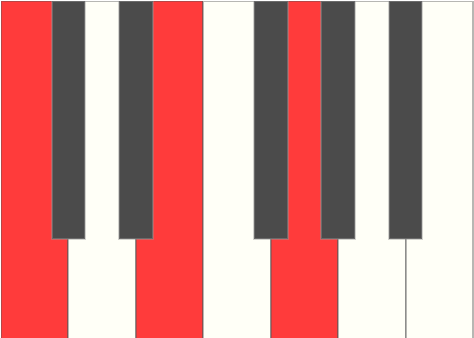
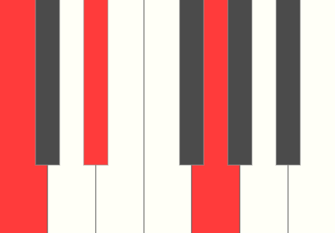
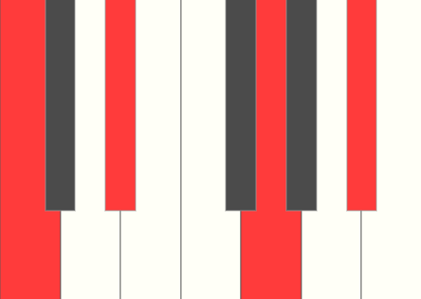

A chord is a group of notes played simultaneously. The harmonic structure of a piece of music is defined by a series of chords. For a musical piece to sound good, the melody should fit within your series of chords.

The relationship between the notes, the intervals within the chord define the type of chord. A basic chord consists of three notes called a `triad` and the notes are called `root`, `third`, and `fifth`. The root defines the key of the chord and the type of chord is determined by the middle note - the third. Let's look at the `C Major` chord.

### C Major Chord

A `Major Third` is two whole steps or 4 half steps between the first note and the second note. Another way to represent a major chord is __$1-3-5$__, where the third is a major third.

### C Minor Chord

A `Minor Third` is 3 half steps and another way to represent a minor chord is __$1-\flat3-5$__, where the third is a minor third.

Now that you know what a minor and major third is. Let's extend our chords and add more thirds to it!

### C Major Seventh Chord

The major seventh chord is a major chord with an added major third also known as __$1-3-5-7$__, where the seventh is a major third.

### C Minor Seventh Chord

The minor seventh chord is a minor chord with an added minor third also known as __$1-\flat3-5-\flat7$__, where the seventh is a minor third.

You can keep adding more thirds as you extend your chords, but remember adding more thirds add more color or flavor to the sound and most of the time seventh are enough.

There are many more different types of chord and the chart below will give you the formula to them using C as the key. Remember, $\flat$ means lowered a half step and # means raised half-step. The chart should help you know the name of a chord.

### Chords in C

| Symbol               | Type                             | Formula                       |
| -------------------- | -------------------------------- | ----------------------------- |
| C                    | major                            | $1-3-5$                       |
| Cm                   | minor                            | $1-\flat3-5$                  |
| C+                   | augmented                        | $1-3-\sharp5$                 |
| Cdim                 | diminished                       | $1-\flat3-\flat5$             |
| Csus2                | suspended second                 | $1-2-5$                       |
| Csus4                | suspended fourth                 | $1-4-5$                       |
| C add9               | added ninth                      | $1-3-5-9$                     |
| Cm add9              | minor added ninth                | $1-\flat3-5-9$                |
| C6                   | sixth                            | $1-3-5-6$                     |
| Cm6                  | minor sixth                      | $1-\flat3-5-6$                |
| C6/9                 | sixth, added ninth               | $1-3-5-6-9$                   |
| Cm6/9                | minor sixth, added ninth         | $1-\flat3-5-6-9$              |
| C7                   | seventh                          | $1-3-5-\flat7$                |
| Cdim7                | diminished seventh               | $1-\flat3-\flat5-\flat\flat7$ |
| C7sus4               | seventh, suspended fourth        | $1-4-5-\flat7$                |
| Cmaj7                | major seventh                    | $1-3-5-7$                     |
| Cm7                  | minor seventh                    | $1-\flat3-5-\flat7$           |
| Cm maj7              | minor, major seventh             | $1-\flat3-5-7$                |
| Cmaj7$\flat$5        | major seventh, flat fifth        | $1-3-\flat5-7$                |
| Cm7$\flat$5          | minor seventh, flat fifth        | $1-\flat3-\flat5-\flat7$      |
| C7$\sharp$5          | seventh, sharp fifth             | $1-3-\sharp5-\flat7$          |
| C7$\flat$5           | seventh, flat fifth              | $1-3-\flat5-\flat7$           |
| C7$\flat$9           | seventh, flat ninth              | $1-3-5-\flat7-\flat9$         |
| C7$\sharp$9          | seventh, sharp ninth             | $1-3-5-\flat7-\sharp9$        |
| C7$\sharp$5 $\flat$9 | seventh, sharp fifth, flat ninth | $1-3-\sharp5-\flat7-\flat9$   |
| C9                   | ninth                            | $1-3-5-\flat7-9$              |
| Cmaj9                | major ninth                      | $1-3-5-7-9$                   |
| Cm9                  | minor ninth                      | $1-\flat3-5-\flat7-9$         |
| C11                  | eleventh                         | $1-5-\flat7-9-11$             |
| Cm11                 | minor eleventh                   | $1-\flat3-5-\flat7-9-11$      |
| C13                  | thirteenth                       | $1-3-5-\flat7-9-13$           |

### Inversions

One last thing about chord is you can invert them to make them sound a bit different and make them easier to play. To invert a chord, you take the lowest note and move it one octave. You can continue inverting your chord until your chord is the same but one octave higher.
