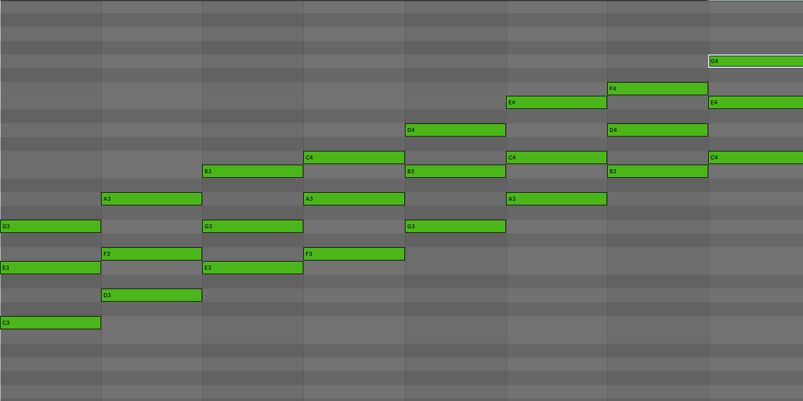

Once you understand what a scale and chord is, the next step is to learn about chord progressions. A chord progression is a series of well-arranged chords that produces a natural sound. We can start by understanding all the chords in a scale. A scale has seven notes, which tells us we can create seven different chords in the scale. To do this, we'll start with the `C Major` scale. To build each chord we will start at the root through our seventh note using our knowledge of minor and major chord.

### C Major Chords

I created these chords in Ableton, as you can see, we have seven unique chords and the root chord is shown twice first and last. We can name each chord similar to when we named each note in the scale. The naming convention for chords is Roman numerals $\textrm {I}$ through $\textrm {VII}$, where uppercase for major chords and lowercase for minor chords. Additionally, a diminished chord uses the lowercase Roman numeral plus a small circle while an augmented chord uses the uppercase Roman numeral plus a small plus sign.

### Major Chords Roman Numeral Table

| Name         | Roman Numeral        |
| ------------ | -------------------- |
|Tonic         |  $\textrm {I}$         |
|Supertonic    |  $\textrm {ii}$      |
|Mediant       |  $\textrm {iii}$     |
|Subdominant   |  $\textrm {IV}$        |
|Dominant      |  $\textrm {V}$         |
|Submediant    |  $\textrm {vi}$        |
|Leading Tone  |  $\textrm {vii}^\circ$ |

Remember a quick and easy way to know if it's a major or minor chord is counting the semitones between the root and the third. A major chord has a major third which is four semitones away from the root, while a minor chord has a minor third which is 3 semitones away from the root.

Now let's look at the relative scale of `C Major` which is `A Minor` to get an idea of the Roman numeral naming convention for a minor scale.

### A Minor Chords

As you can see the tonic chord for a minor scale is a minor, while the tonic for a major scale is a major chord. You might already guess that both `C Major` and `A Minor` has the same chords, but the order is different! The Tonic of `A Minor` chords is the same as the Submediant of `C Major` chords.

### Minor Chords Roman Numeral Table

| Name         | Roman Numeral         |
| ------------ | --------------------- |
|Tonic         |  $\textrm {i}$        |
|Supertonic    |  $\textrm {ii}^\circ$ |
|Mediant       |  $\textrm {III}$      |
|Subdominant   |  $\textrm {iv}$       |
|Dominant      |  $\textrm {v}$        |
|Submediant    |  $\textrm {VI}$       |
|Leading Tone  |  $\textrm {VII}$      |

Now that we know the naming convention for chords it's easier to read and write chord progressions! You can find many chord progressions online, but remember your melody is based off your chord progression and vice versa. I want to end by quickly by talking about `cadence`. 

Cadence is how you end your chord there are two common ways to end your chord, perfect cadence $\textrm {V} - \textrm {I}$ or plagal cadence $\textrm {IV} - \textrm {I}$. Ending your chord progression with a cadence give it a natural ending.
